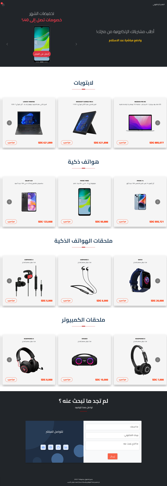

# E-commerce Website

This is a sample application that demonstrates an E-commerce website using the CMS. The application loads
products from a Sanity and displays them. Users can select to display products in a single category. Users can
click on any product to get more information including pricing, reviews and rating. Users can select items and
add them to their shopping cart..

## Tech used

- React.JS
- Next.js
- Sanity CMS
- Bootstrap + react-bootstrap
- Context API

## How it Works

All the content is being controlled by Sanity manager dashboard, you can add ir remove projects, change the banner items, even the banner text can be changed from there, any new category will be automatically added to page in a new section...

## Live Demonstration

The E-commerce demo can be [viewed online here](#).

Here are screenshots that show the E-commerce demo application in use.

**Home Page**

---

**Item Detail Page**

---
